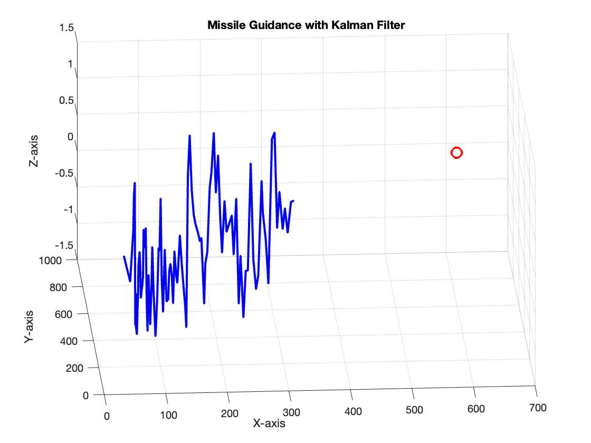
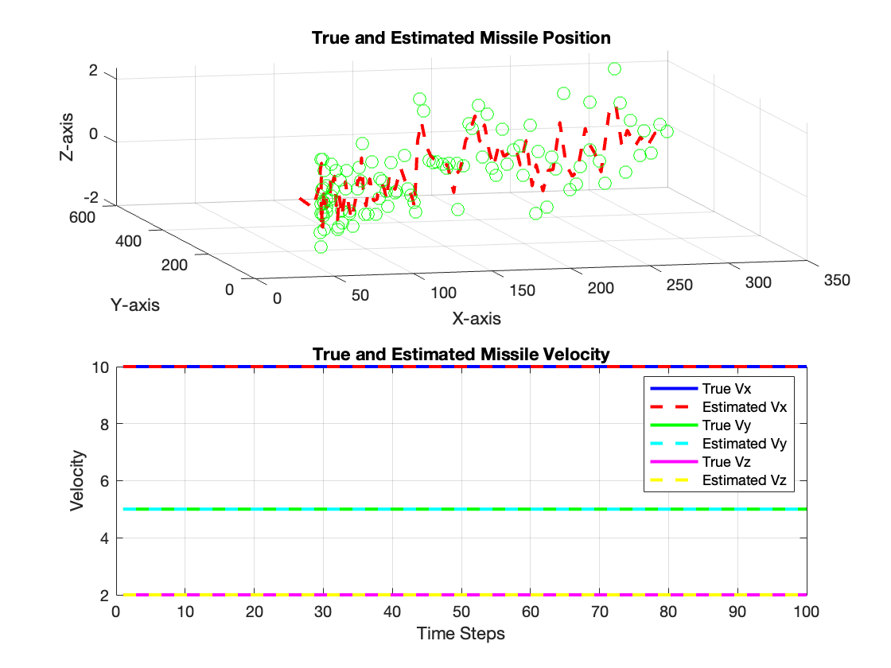

# Missile Guidance with Kalman Filter

## Overview

This MATLAB project simulates a missile guidance system using a Kalman filter to estimate the target's motion and an Infrared (IR) sensor for distance measurements. The system features 3D visualization and animation to illustrate the missile's trajectory and interception of a moving target.

## Key Features

- **Kalman Filter:** Utilizes a Kalman filter to estimate the target's position based on noisy measurements from an IR sensor.
- **Moving Target:** Simulates a moving target with sinusoidal motion to challenge the missile's guidance system.
- **IR Sensor:** Incorporates an Infrared sensor to provide distance measurements between the missile and the target.
- **3D Visualization:** Displays the missile's trajectory and target motion in a 3D plot for better understanding.

## Examples

*Figure 1: Missile Guidance with Kalman Filter*

*Figure 2: True and Estimated Missile Position and Velocity*

## Usage

1. **Clone the Repository:**

git clone https://github.com/magnaprog/Missile-Guidance-Kalman-Filter
cd Missile-Guidance-Kalman-Filter

2. **Run the MATLAB Script:**
Open MATLAB and run the `missile_guidance_kalman_moving_target.m` script.

3. **Explore and Customize:**
Modify the script to experiment with different parameters, noise levels, or system dynamics to suit your specific requirements.

## Dependencies

- MATLAB (R2019b or later)

## Contributing

Feel free to contribute to the project by opening issues, proposing new features, or submitting pull requests. Your feedback and contributions are highly appreciated!

## License

This project is licensed under the [MIT License](LICENSE).
